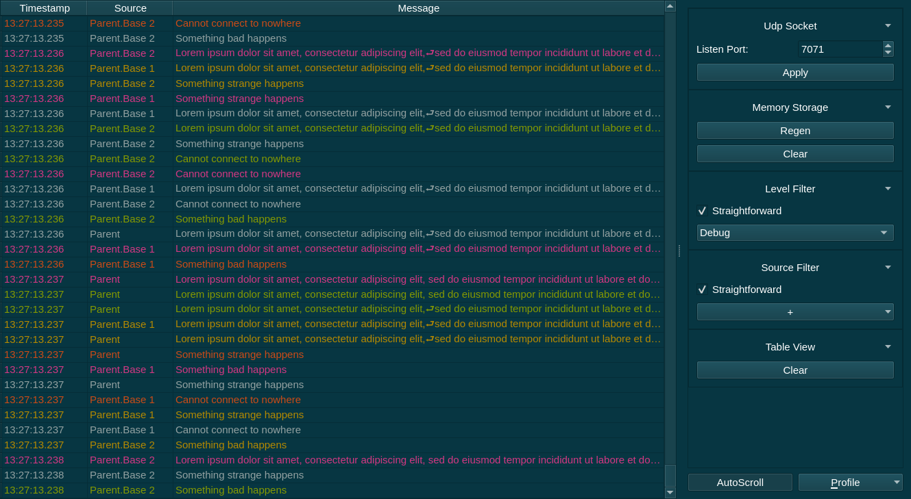

**antilogviewer** is yet another log viewer for log4j library and its various ports for other languages.
It has good performance, small memory footprint and flexible filter system... and of course, dark theme.

Motivation
==========

During our working hours my colleagues and I've spent a bunch of time through challinging a lot of different tools to view logs.
We have tried a lot of of free and commercial tools and I have not found anything which would fullfill all our needs.
This project is an attempt to fix all issues which we faced with other log viewers:

* **High Performance.**
  Almost all log viewers try to refilter all log events on any user action.
  It leads to an unnecessary event list, updating which you can spend a lot of time.
The Wireshark is a good exception here... but it is not a log viewer, despite the fact that it can be used for it.
  antilogviewer suggests that all such actions will be done explicitly.
* **Maintanable codebase.**
  antilogviewer follows the KISS principle and tries to be as simple as it is possible.
  It does not contain too complicated architecture and it is based on two very simple things: the thin infrastructure code (1) which manages a lot of filter chain elements (2).
* **Small Memory Footprint.**
  QT UI elements don't have the smallest memory usage characteristics but they are still small.
  Moreover, they provide an easy-to-use interface for development and a good abstraction for virtualization, so it is the best tradeoff among all the criteria.
  The flexible filter system allows to discard all unnecesary events in the early stages that allows not to keep them in memory at all.
* **Flexible filter system.**
  The Wireshark is a good example of how filters can be implemented: we can discard the biggest part of unnecesary events in a capture filter and work with much more modest list of events in the display filter.
  But, as I've mentioned earlier, the Wireshark is not a log viewer.
  antilogviewer tries to follow and improve the Wireshark path based on a flexible filter system which allows to set as much levels of filters as you want.
* **Dark Theme.**
  No comments are required here.
* **Cost.**
  antilogviewer is a free opensource product licensed under a quite loyal MPL2 license.
  You can use it for any commercial aims and implement specific functionality for your purposes.

Shut Up and Take My Mon... Respect
==================================

Get latest version:

- Windows: use binaries from [AppVeyor](https://ci.appveyor.com/project/anticodeninja/antilogviewer/build/artifacts).
- Linux: you choose the way, compile it from sources.
- Mac: the same, compile it from sources or pay someone who can do it for you.

Documentation
=============

*Coming soon. Please wait...*

Contributing
============

Patches/issues/another feedback are welcome.
